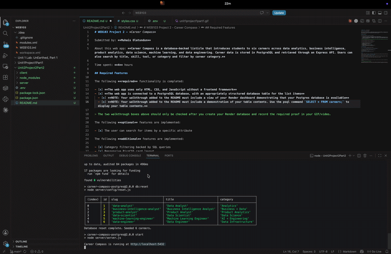

# WEB103 Project 2 - *Career Compass*

Submitted by: **Muhais Olatundun**

About this web app: **Career Compass is a database-backed listicle that introduces students to six careers across data analytics, business intelligence, product analytics, data science, machine learning, and data engineering. Career data is stored in PostgreSQL and retrieved through an Express API. Users can also search by title, skill, tool, or category and filter by career category.**

Time spent: **4** hours

## Required Features

The following **required** functionality is completed:

- [x] **The web app uses only HTML, CSS, and JavaScript without a frontend framework**
- [x] **The web app is connected to a PostgreSQL database, with an appropriately structured database table for the list items**
  - [x] **NOTE: Your walkthrough added to the README must include a view of your Render dashboard demonstrating that your Postgres database is available**
  - [x] **NOTE: Your walkthrough added to the README must include a demonstration of your table contents. Use the psql command `SELECT * FROM careers;` to display your table contents.**

> The two walkthrough boxes above should only be checked after you create your Render database and record the required proof in your GIF/video.

The following **optional** features are implemented:

- [x] The user can search for items by a specific attribute

The following **additional** features are implemented:

- [x] Category filtering backed by SQL queries
- [x] Responsive PicoCSS card layout
- [x] Unique detail routes for every career
- [x] Custom 404 page
- [x] Database health-check endpoint at `/health`
- [x] Parameterized PostgreSQL queries to avoid SQL injection
- [x] Database reset/seed script for repeatable setup

## Video Walkthrough

Here's a walkthrough of implemented required features:

<!-- Replace this with whatever GIF tool you used! -->
GIF created with https://ezgif.com/video-to-gif GIF tool here
<!-- Recommended tools:
[Kap](https://getkap.co/) for macOS
[ScreenToGif](https://www.screentogif.com/) for Windows
[peek](https://github.com/phw/peek) for Linux. -->

## Notes

## License

Copyright 2026 Muhais Olatundun

Licensed under the Apache License, Version 2.0 (the "License"); you may not use this file except in compliance with the License. You may obtain a copy of the License at

> http://www.apache.org/licenses/LICENSE-2.0

Unless required by applicable law or agreed to in writing, software distributed under the License is distributed on an "AS IS" BASIS, WITHOUT WARRANTIES OR CONDITIONS OF ANY KIND, either express or implied. See the License for the specific language governing permissions and limitations under the License.
